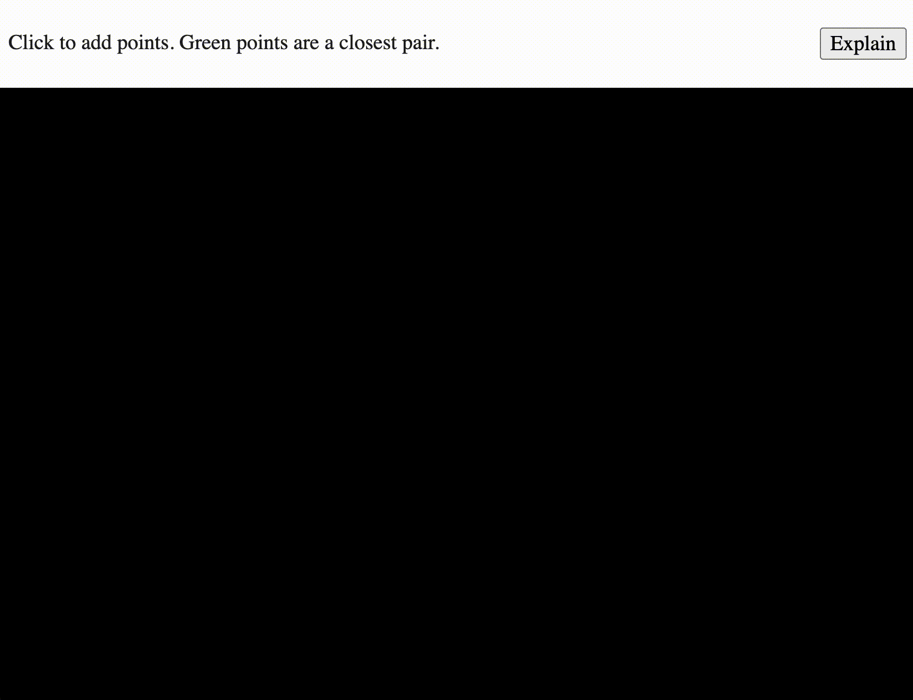

# Closest pair of points

This is an interactive implementation/explanation of the closest pair algorithm in two dimensions. Further details on the O(nlog n) divide-and-conquer approach can be found in the slides for [MIT's Geometric Computing](https://people.csail.mit.edu/indyk/6.838-old/handouts/lec17.pdf).

[Try out the demo here](TODO)!

## Implementation details

This project uses the [p5js boilerplate](https://github.com/bsplt/p5js-boilerplate) and [p5js](https://p5js.org/) for interactivity.